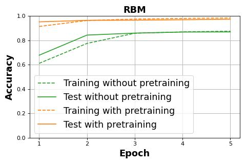
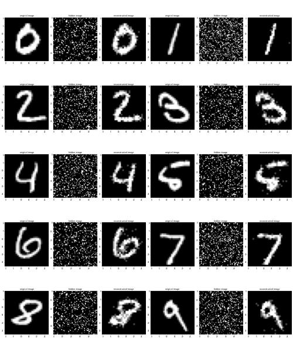
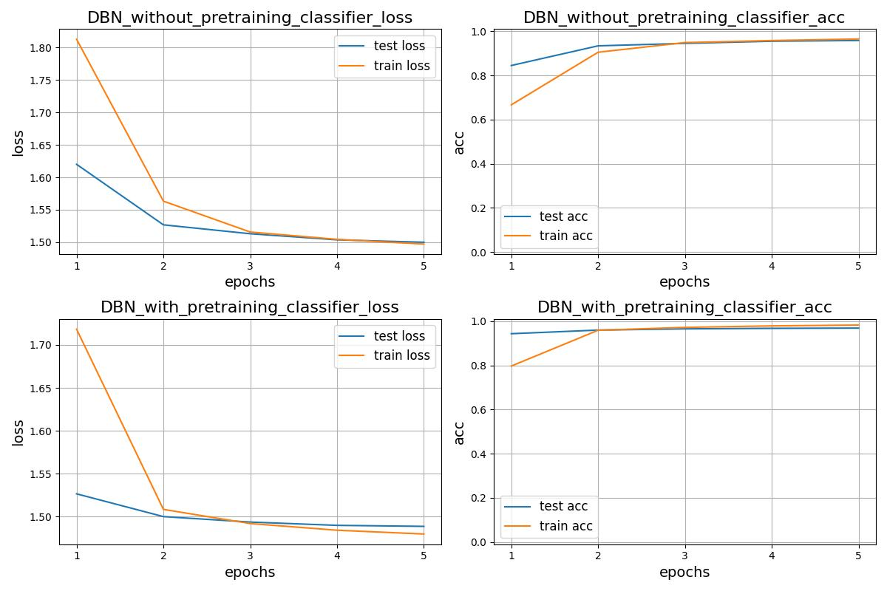
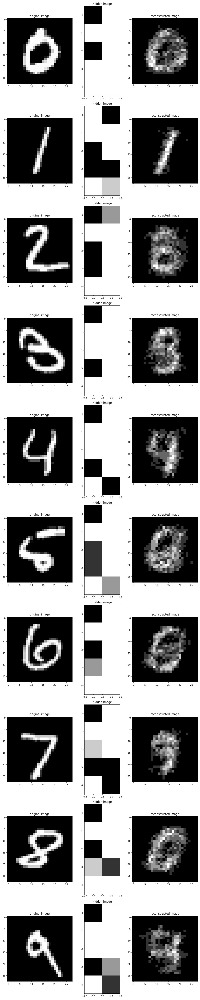

# Energy Based Models in PyTorch

The aim of this repository is to create Energy Based Models (EBM) in generalized manner, so as to allow modifications and variations.

## Restricted Boltzmann Machine

Energy-Based Models are a set of deep learning models which utilize physics concept of energy.
They determine dependencies between variables by associating a scalar value, which represents the energy to the complete system.

* It is a probabilistic, unsupervised, generative deep machine learning algorithm.
* It belongs to the energy-based model
* Restricted Boltzmann Machine (RBM) is undirected and has only two layers, Input layer, and hidden layer
* No intralayer connection exists between the visible nodes. 
* All visible nodes are connected to all the hidden nodes

In an RBM, we have a symmetric bipartite graph where no two units within the same group are connected.
Multiple RBMs can also be stacked and can be fine-tuned through the process of gradient descent and back-propagation.
Such a network is called a Deep Belief Network.

The above project allows one to train an RBM and a Deep Belief Network (DBN) in PyTorch on both CPU and GPU.
Finally let us take a look at some of the reconstructed images.

## Results of RBM



```
Unsupervised pretraining of Restricted Boltzmann Machine
epoch   5/  5 train loss  0.068 12.8sec

Training without pretraining
epoch  1/ 5 train loss 1.684 train acc 0.789  6.3sec
epoch  2/ 5 train loss 1.584 train acc 0.880  6.4sec
epoch  3/ 5 train loss 1.517 train acc 0.947  6.4sec
epoch  4/ 5 train loss 1.506 train acc 0.957  6.4sec
epoch  5/ 5 train loss 1.498 train acc 0.965  6.3sec

Training with pretraining
epoch  1/ 5 train loss 1.560 train acc 0.918  6.4sec
epoch  2/ 5 train loss 1.500 train acc 0.965  6.4sec
epoch  3/ 5 train loss 1.488 train acc 0.976  6.4sec
epoch  4/ 5 train loss 1.481 train acc 0.982  6.4sec
epoch  5/ 5 train loss 1.477 train acc 0.986  6.4sec
```

## Images of RBM



## Deep Belief Networks

In machine learning, a Deep Belief Network (DBN) is a generative graphical model, or alternatively a class of deep neural network, composed of multiple layers of latent variables ("hidden units"), with connections between the layers but not between units within each layer.

When trained on a set of examples without supervision, a DBN can learn to probabilistically reconstruct its inputs.
The layers then act as feature detectors. After this learning step, a DBN can be further trained with supervision to perform classification.

DBNs can be viewed as a composition of simple, unsupervised networks such as restricted Boltzmann machines (RBMs) or autoencoders, where each sub-network's hidden layer serves as the visible layer for the next.
An RBM is an undirected, generative energy-based model with a "visible" input layer and a hidden layer and connections between but not within layers. This composition leads to a fast, layer-by-layer unsupervised training procedure, where contrastive divergence is applied to each sub-network in turn, starting from the "lowest" pair of layers (the lowest visible layer is a training set).

The observation that DBNs can be trained greedily, one layer at a time, led to one of the first effective deep learning algorithms.
Overall, there are many attractive implementations and uses of DBNs in real-life applications and scenarios (e.g., electroencephalography, drug discovery).

### Results of DBN



```
Unsupervised pretraining of Deep Belief Network
epoch 100/100 train loss  0.085  1.9sec
Finished Training Layer: 0 to 1
epoch 100/100 train loss  0.165  0.5sec
Finished Training Layer: 1 to 2
epoch 100/100 train loss  0.187  0.4sec
Finished Training Layer: 2 to 3
epoch 100/100 train loss  0.244  0.4sec
Finished Training Layer: 3 to 4

Training without pretraining
epoch  1/ 5 train loss 1.813 train acc 0.667  4.579sec
epoch  2/ 5 train loss 1.563 train acc 0.905  4.735sec
epoch  3/ 5 train loss 1.516 train acc 0.949  4.724sec
epoch  4/ 5 train loss 1.504 train acc 0.958  4.741sec
epoch  5/ 5 train loss 1.497 train acc 0.965  4.755sec

Training with pretraining
The Last layer will not be activated. The rest are activated using the Sigmoid Function
epoch  1/ 5 train loss 1.702 train acc 0.820  4.721sec
epoch  2/ 5 train loss 1.507 train acc 0.960  4.714sec
epoch  3/ 5 train loss 1.493 train acc 0.971  4.727sec
epoch  4/ 5 train loss 1.485 train acc 0.978  4.698sec
epoch  5/ 5 train loss 1.480 train acc 0.983  4.733sec
```

## Images of DBN


